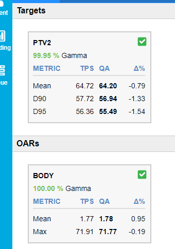
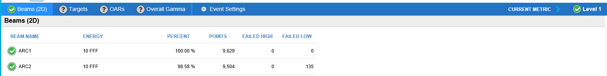

### SunCheck Analysis (for ~~PlanCheck,~~ DoseCheck and Fraction 0)

Log in, preferably using script from ARIA or using http://onc-sunjob1 if outside VLAN.

~~### PlanCheck~~

~~Under "Custom Dosimetric Template" select "PlanCheck"~~

~~Under "Physics" select the most appropriate Physics template e.g. SABR.~~

### DoseCheck

Only interested in relevant PTV and Body:

Looking at PTV and Body gamma
- Approve without comment for Level 1
- Add comments for Level 2 pass and above
- If fails at Level 2 involve an MPE
- Leave the current metric on the level it passes at when producing report
- Create a "plan report" in SunCheck and save as a "Treatment plan QA report" in ARIA documents.

### Fraction 0

Look at results and approve if passing:

Be careful over average pass. Tolerance for overall pass is based on average of all arcs. Check individual arcs also pass for Level 1. Can go on a "reasonable" mean for Level 2.

### Saving plan report
- Once the ~~PlanCheck,~~ DoseCheck and Fraction 0 results have been approved, produce a pdf of the patient plan report (note this need to be done within the VLAN)
- Save in ARIA documents
- Deactivate the patient plan on SunCheck

### Fraction n
see seperate [note](./fraction_n_analysis.md)

[up](README.md)
[top](../README.md)
