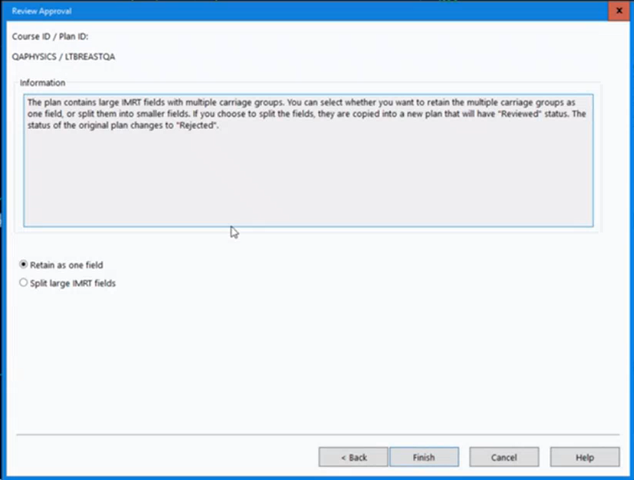

### Breast Planning

#### Useful documents
- TP-PRT-1  Treatment planning protocols
- TP-GD-63  Planning Breast/SFX/Axilla IMRT
- TP-GD-92  Planning Breast IMRT
- TP-CP-1  Breast clinical protocol
- TP-CP-3  SCF/AX clinical protocol

#### Things to remember

- Delete reference point location
- Delete MLCs from setup fields
- Time: set to 2.00 mins for breast fields, 1.00 min for SCF/Ax field
- Currently we are NOT using jaw tracking for breast patients but this may change in th future

#### Split carriage for large fields (X>14cm)

First, check whether it is possible to move the isocentre in order to not produce a plan where X>14cm.  Moving the isocentre may negate the need for this. Alternatively a small reduction in flash, particularly for breath hold patients, may be preferable.

An X field size of 14cm will require the use of split carriage

We no longer need to split the anterior and posterior partial fields 

Check that the MLC motion looks reasonable. It is known to occasionally produce weird leaf motions.

When the plan is reviewed the clinician will get the following message:

They should accept the default option ("Retain as one field")

[up](README.md)

[top](../README.md)
